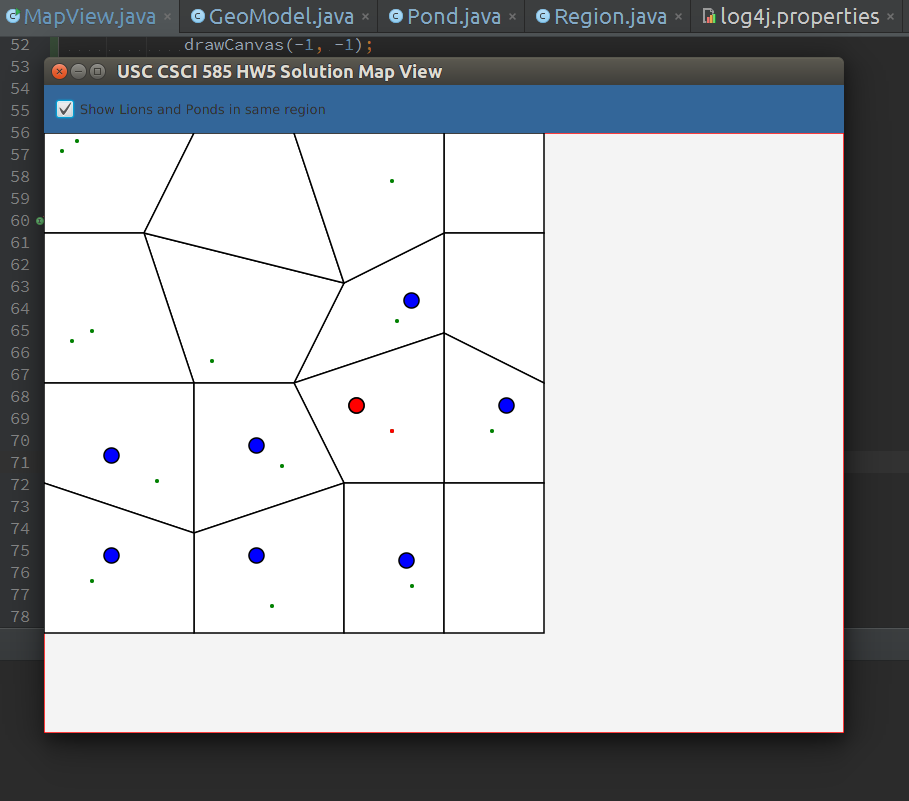

#Homework 5 Solution
   This project was created to full fill USC Fall 2015 CSCI-585 Coursework requirements.
   The main purpose of the project is to demonstrate that the student/developer has understood the concepts of
   Spatial Operations with Relational Databases and JDBC.  
   An user interface is created to show the spatial data and to interact with it.

## Developer
  + ThammeGowda N., USCID:2074669439, tnarayan (at) usc.edu

## Requirements
  + Newer JDK, tested on 1.8
  + Newer Apache Maven, Tested on 3.33
  + Oracle libraries : JDBC jar, SDOAPI.jar

## Pre Setup
1. Install Oracle Driver
 Download Oracle JDBC driver http://www.oracle.com/technetwork/database/features/jdbc/index-091264.html

   ```$ mvn install:install-file -DgroupId=com.oracle -DartifactId=ojdbc6 -Dversion=xyz -Dpackaging=jar -Dfile=ojdbc6.jar -DgeneratePom=true```

 Download Oracle SDOAPI.jar, this one is hard to get, Comes with oracle standard/enterprise edition

   ```$ mvn install:install-file -DgroupId=com.oracle -DartifactId=sdoapi -Dversion=xyz -Dpackaging=jar -Dfile=sdoapi.jar -DgeneratePom=true```

## Database Configuration
  + Please update the DB settings in the file : `src/main/resources/db.props`
  + To populate the database with initial set of records, refer to : `src/main/resources/createdb.props`

## Build and run
  + To package, run : `mvn clean package`. This should produce a file `target/mapview-jfx-1.0-SNAPSHOT-jar-with-dependencies.jar`
  + To launch the interface, run `java -jar target/mapview-jfx-1.0-SNAPSHOT-jar-with-dependencies.jar`
  
## Screenshots 
  + 
